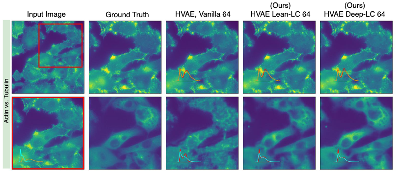

# μSplit
</img>

This is the official implementation of [μSplit: image decomposition for fluorescence microscopy](https://arxiv.org/abs/2211.12872).

## Installation
```bash
git clone https://github.com/juglab/uSplit.git
cd uSplit
conda create -n usplit python=3.9
conda activate usplit
./install_deps.sh
pip install -e .
```
In case, one wants to do training, then one also needs to create an account on [wandb](https://docs.wandb.ai/quickstart). This is used for logging training and evaluation metrics. In case you do not want to use wandb, you can replace the logger [here](usplit/training.py#L406) with a logger of your choice and comment out [here](usplit/training.py#L349).

## Data
For Hagen et al. dataset, please download the data from [here](http://gigadb.org/dataset/100888). You need to download the following files:
```
1. actin-60x-noise2-highsnr.tif
2. mito-60x-noise2-highsnr.tif
```
For our PaviaATN dataset, please download the data from [here](https://zenodo.org/record/8235843). 
<!-- For our Synthetic dataset SinosoidalCritters, please download the data from [here](https://zenodo.org/record/1203745#.YKZ2ZegzZPY). -->

For each dataset, create a separate directory and put the files in the directory. The directory should not contain any other files.

## Network training
To train one of our LC variants on the Hagen dataset, run this command:
```bash
python /home/ubuntu/code/uSplit/uSplit/scripts/run.py --workdir=/home/ubuntu/training/uSplit/ -mode=train --datadir=/home/ubuntu/data/ventura_gigascience/ --config=/home/ubuntu/code/uSplit/usplit/configs/lc_hagen_config.py
```

For training our Lean-LC model, do the following hyperparameter assignment in `lc_hagen_config.py`
1. Set `model.decoder.multiscale_retain_spatial_dims=False`. 
2. Set `model.z_dims = [128, 128, 128, 128]`.

For training our Regular-LC model, do the following hyperparameter assignment in `lc_hagen_config.py`
1. Set `model.decoder.multiscale_retain_spatial_dims=True`.
2. Set `model.z_dims = [128, 128, 128, 128]`.

For training our Deep-LC model, do the following hyperparameter assignment in `lc_hagen_config.py`
1. Set `model.decoder.multiscale_retain_spatial_dims=True`.
2. Set `model.z_dims = [128, 128, 128, 128, 128, 128, 128, 128]`. 

To train the Vanilla baseline, set `data.multiscale_lowres_count = None`. To train HAE version, set `model.non_stochastic_version = True`. For HVAE version, set `model.non_stochastic_version = True`.

We have also provided the configs for training on our PaviaATN dataset and SinosoidalCritters dataset. Above mentioned hyperparameter settings needs to be changed accordingly.

## Evaluation
For evaluation, we have provided the notebook [here](examples/Evaluate.ipynb) and the pre-trained models [here](https://zenodo.org/record/8324707).

## Training on your own data. 
Codebase will require minimal changes if the data is organized in one of the three ways:
1. A single tiff file with data shape (N,H,W,C) where C denotes the channel dimension which one intends to split. In this case, simply use `DataType.OptiMEM100_014` as the `data.data_type` in the config. 
2. Two tiff files, each with data shape (N, H, W) and corresponding to one channel. Use `DataType.SeparateTiffData` as the `data.data_type` in the config.
3. A .zarr file directory with data shape (N,H,W,C). Use `DataType.SingleZarrData` as the `data.data_type` in the config.

No other changes should be required and at this point, one can start the training. Note that input will be created by summing the two channels present in the data.

### Steps for data organized in a different way.
1. Add an entry in `DataType` class for your own data. For example,
```
MyDataABC = 17
```
2. In `train_val_data.py`, create a function which returns returns the train/val/test data with (N,H,W,C) dimension arrangement.
3. In `training.py:create_dataset()` you may have to set `dataclass` variable appropriately in case your data is .zarr. 
